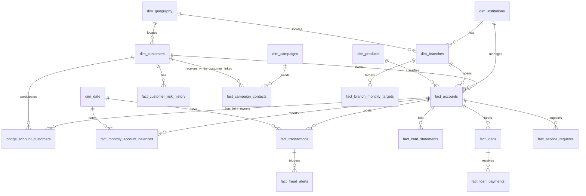

# Entity Relationship Diagram

## Modelling notes

- The model uses dimensions, facts, and a bridge table to support many-to-many account ownership.
- `fact_monthly_account_balances` is the main monthly performance fact.
- `fact_transactions` is the transaction-level activity table.
- `fact_customer_risk_history` behaves like a slowly changing history table with current and historical records; `credit_score` is nullable for new-to-credit, thin-file, or unscoreable customers.
- `fact_campaign_contacts.customer_id` is optional because campaign activity can include prospects or anonymous/pre-acquisition leads; populated values can still be validated against `dim_customers`.
- Marts in the `mart` schema are built on top of these typed source tables.
